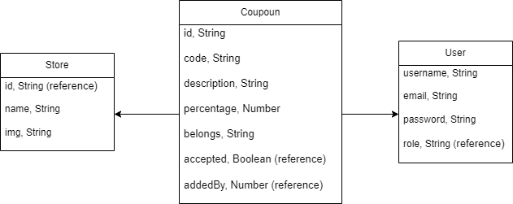
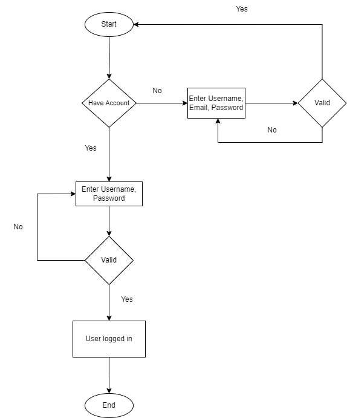
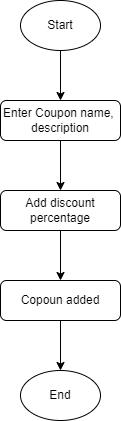
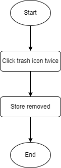

# Documentation

## Diagrams

### Database structure (Schema)

### Login Process

### Add coupon to a store

### Remove store from a list

## Routers

### user.controller

 **Purpose** : Manages user-related operations such as registration, login, and logout.

 **Routes and Functions** :

1. **Registration Route (/register)**
   * **Validation** : Ensures the request body contains `username`, `password`, and `email`.
   * **Uniqueness Checks** : Verifies that the `username` and `email` are unique in the database.
   * **User Creation** : Creates and saves a new user in the database.
   * **Error Handling** : Catches any errors during the process and responds appropriately.
2. **Logout Route (/logout)**
   * **Authentication** : Uses `checkAuth` middleware to ensure the user is authenticated.
   * **Session Destruction** : Destroys the user's session to log them out.
   * **Response** : Sends a success message upon successful session destruction.
3. **Login Route (/login)**
   * **Validation** : Ensures the request body contains `username` and `password`.
   * **User Search** : Finds the user by `username` in the database.
   * **Password Verification** : Verifies the provided password matches the stored password.
   * **Session Management** : Manages user session properties (e.g., setting session variables).
   * **Error Handling** : Catches any errors during the login process and responds appropriately.

### store.controller

 **Purpose** : Manages store-related operations.

 **Routes and Functions** :

1. **Add Store Method (/add)**
   * **Validation** : Checks if the necessary fields (like store name and location) are present.
   * **Authentication** : Ensures the user is authenticated.
   * **Create Store** : Creates and saves a new store in the database.
   * **Response** : Sends a success or error message based on the operation's outcome.
2. **Remove Store Method (/remove)**
   * **Validation** : Verifies that the `storeId` is present in the request.
   * **Authorization** : Ensures that the user has the necessary permissions (e.g., isAdmin).
   * **Remove Store** : Deletes the specified store.
   * **Response** : Sends a success or error message based on the operation's outcome.
3. **Update Store Method (/update)**
   * **Validation** : Verifies that the `storeId` and updated fields are present in the request.
   * **Authorization** : Ensures that the user has the necessary permissions (e.g., isAdmin).
   * **Update Store** : Updates the specified store's details.
   * **Response** : Sends a success or error message based on the operation's outcome.

### coupon.controller

 **Purpose** : Manages coupon-related operations.

 **Routes and Functions** :

1. **Add Coupon Method (/add)**
   * **Validation** : Uses `checkInputs` to ensure necessary fields (`code`, `percentage`, `belongs`) are present.
   * **Authentication** : Requires user authentication.
   * **Verify Store** : Ensures the store exists before creating a coupon.
   * **Create Coupon** : Creates and saves a new coupon in the database.
   * **Response** : Sends a success or error message based on the operation's outcome.
2. **Remove Coupon Method (/remove)**
   * **Validation** : Uses `checkInputs` to ensure the `id` field is present.
   * **Authorization** : Requires administrator privileges (`isAdmin`).
   * **Remove Coupon** : Deletes the specified coupon.
   * **Response** : Sends a success or error message based on the operation's outcome.
3. **Accept Coupon Method (/accept)**
   * **Validation** : Uses `checkInputs` to ensure the `id` field is present.
   * **Authorization** : Requires administrator privileges (`isAdmin`).
   * **Accept Coupon** : Marks the specified coupon as accepted.
   * **Response** : Sends a success or error message based on the operation's outcome.

## Authentication process

1. **Client-Side Form Submission**:

   - User fills in the login form with username and password, or toggles to the registration form and fills in username, email, and password.
   - Form submission triggers a POST request to `/user/login` for login or `/user/register` for registration.
2. **JavaScript Handling**:

   - **Form Switch**:
     - When the user clicks the "inputSwitcher" element, the `switchForm` function toggles between login and registration forms.
     - The form title, button text, and visibility of the email input field are adjusted accordingly.
   - **Form Submission**:
     - An event listener on the form's `submit` event prevents the default form submission.
     - Depending on the form state (login or registration), an asynchronous fetch request is made to the appropriate endpoint with the form data serialized to JSON.
3. **Server-Side Handling**:

   - **Login Request**:
     - Server receives the login request at `/user/login`.
     - The server retrieves the user data based on the provided username.
     - The entered password is compared with the stored hashed password using bcrypt.
   - **Registration Request**:
     - Server receives the registration request at `/user/register`.
     - The server hashes the provided password using bcrypt.
     - The user data, including the hashed password, is saved to the database.

## API responses:

| Key               | Formatted Message                                    | HTTP Code |
|-------------------|--------------------------------------------|-----------|
| INVALID_DATA      | Invalid data                               | 400       |
| USER_NOT_FOUND    | اسم مستخدم/كلمة مرور خاطئة                  | 401       |
| COUPON_NOT_FOUND  | لم يتم العثور على كوبون الخصم                 | 404       |
| STORE_NOT_FOUND   | لم يتم العثور على المتجر                     | 404       |
| USERNAME_IS_TAKEN | اسم مستخدم غير مُتّاح                        | 401       |
| EMAIL_IS_TAKEN    | إيميل غير مُتّاح                            | 401       |
| LOGIN_SUCCESS     | تم تسجيل الدخول بنجاح                       | 200       |
| LOGOUT_SUCCESS    | تم تسجيل الخروج بنجاح                       | 200       |
| COUPON_ADDED      | تم إضافة كوبون الخصم بنجاح                   | 200       |
| COUPON_REMOVED    | تم حذف كوبون الخصم بنجاح                    | 200       |
| COUPON_ACCEPTED   | تم قبول كود الخصم بنجاح                     | 200       |